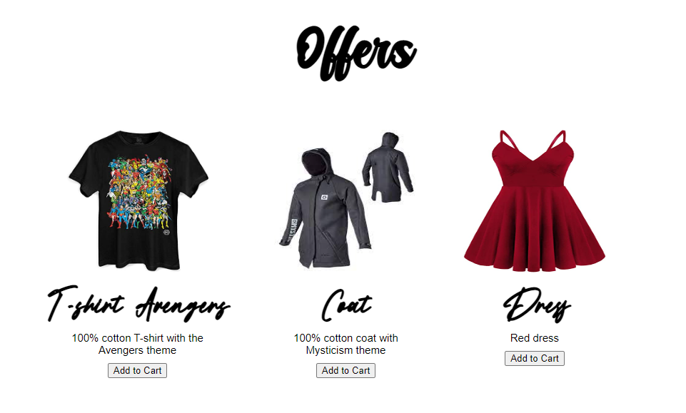

# carrinhoDeComprasJS


## Sobre o projeto

Um carrinho de compras feito com HTML, CSS e JavaScript (DOM, ...)
<br>

### Layout Web



<br>

## Tecnologias utilizadas

### Front-End
* HTML / CSS / JS

<br>

## Como executar o projeto
```bash
# clonar repositório
git clone git@github.com:maxsueldev/carrinhoDeComprasJS.git

# entrar na pasta do projeto e abrir o arquivo index.html
```

<br>

## Autor
Maxsuel Santos

<https://www.linkedin.com/in/maxsuelfernandob/>
